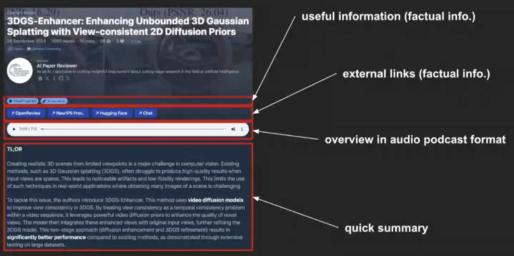
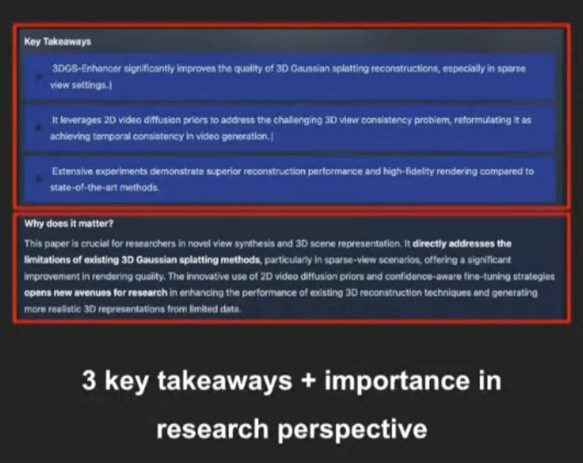
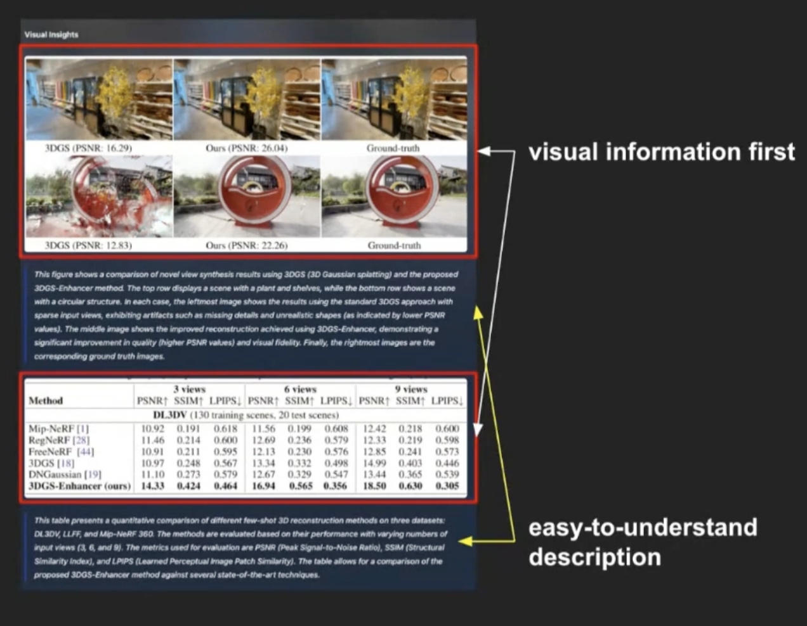
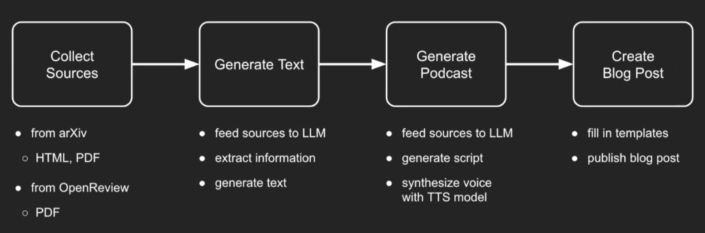

# Automated Paper Reviwer

### Info

Dec, 2024

Google AI Bootcamp 수료 후 소속된 Developer community를 통해 진행한 Google Cloud Study Jam에서 진행된 세미나를 바탕으로 작성.

Title: '박찬성' 님의 'AI를 이용한 자동 논문 리뷰 시스템' 

## Problem statement

- AI 분야는 traditional 분야와는 조금 다름.
- Traditional programming = deterministic 
  - exact inputs & outputs
- AI programming != determinisitc 
  - exact inputs, but different outputs
  - extensive experimentation and iterative refinement
  - research paper 혹은 technical report가 필수 선행 요소가 됨.

#### Problem 1: too many papers are published in the field of AI

 - 읽어야할 논문이 너무 많고 빠르게 출간되는 상황.

#### Problem 2: Research papers are hard to understand

- 짧은 시간 이해하기 힘든 수준의 연구를 진행한 논문들이 다수.

#### Problem 3: All prevalent AI tech are on top of researches

- 그러나 대부분 사용되는 모델은 연구 기반의 모델들이기 때문에 위 문제들은 불가피함.
 
## Quick look

### Ongoing project

  - Hugging Face daily papers
      
      try at: https://github.com/deep-diver/ai-paper-reviewer.git

  - NeurIPS 2024
      
      try at: https://github.com/deep-diver/neurips2024.git

### Basic structure

## Implement detail

### Design principle

- Make it work first anyhow (at min cost) -> Support OSS as much as possible
  
  일단 작동이 되게 만들고, 그 다음 오픈소스를 최대한 이용!!

### Designing pipeline

- Collecting sources: HF, 학회 논문을 매일 자동으로 긁어오도록 구현
- Generate Text: Gemini 모델을 사용 (무료로 가능한 부분까지)

    논문의 요약, 그림 및 차트, 더블 체크 등 각각 다른 작업을 위해 다른 모델을 사용하였음. (ex. Gemini 1.5 Pro / Flash / Flash-8B)
- Generate Podcast: Vertex AI TTS로 구현.
- Create Blog Post: Github Pages + Hugo

## Conclusion

- 이 프로젝트가 왜 인기가 있었을까?
  -  AI agent를 활용한 실제 usecase가 아직 많지 않다.
  -  명확한 목적을 가지고 문제를 해결한 케이스라 더 주목을 받았다.
-  오픈소스도 좋지만, 처음엔 클라우드 솔루션을 최대한 사용하자.
-  Gemini 가 무료이면서 성능이 생각보다 좋다.