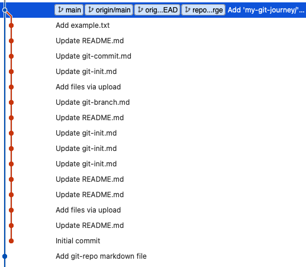

# Git repository 관리

Github에 입문하면서 repository를 깔끔하고 효율적으로 관리하는 법을 하나 하나 기록하는 페이지

## Github에 이미 올라간 repository를 다른 폴더에 병합하기

처음에 깃을 공부하면서 my-git-journey라는 프로젝트 폴더를 만들어 활용했는데, 추후에 TIL 폴더에 공부한 자료들을 정리하면서 이 프로젝트를 TIL로 병합, 수정 및 삭제 등을 하고 싶어졌다.

- TIL/git 하위 폴더로 my-git-journey 프로젝트 내용을 병합한다.
- 이전 커밋 기록이 사라지지 않았으면 좋겠다.

해결 방법

```bash
git subtree add prefix=(하위 디렉토리 이름 설정) (옮길 레포지토리 디렉토리) (옮길 레포지토리 브랜치)
git add .
git push
```
다음과 같이 하위폴더 생성과 함께 이전 커밋 기록이 담긴 브랜치와 병합할 수 있었다.



참고 사이트: https://mgyo.tistory.com/385