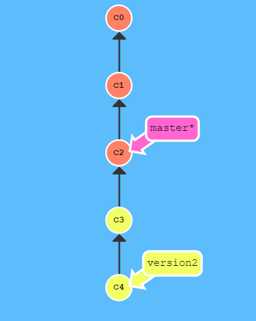
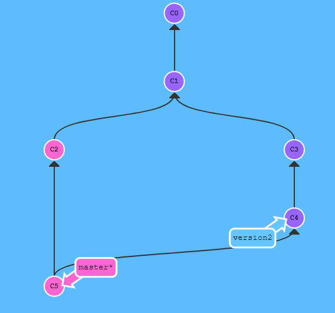

# git basic

## git 명령어 요약

- clone: 원격 저장소 복사
- add: 스테이지 영역에 작업 파일 추가
- commit: 세이브, 스테이지 영역의 파일들을 가지고 커밋(세이브)를 만들 수 있다.
- push: 원격저장소에 커밋을 업로드 한다.

## git 변경사항 취소

- 특정 파일의 내용을 마지막 커밋으로 되돌리고 싶다면 (실행취소 개념) 해당 파일 선택 후 '코드 뭉치 버리기' (sourcetree)

## 브랜치 변경하기

- 브랜치(brach): 기존 내용을 유지한 채 새로운 내용을 추가하는 분기 생성
- checkout: 특정 브랜치 혹은 커밋으로 돌아가고 싶을 때 사용 (sourcetree에서는 브랜치 더블클릭)

## merge 알아보기

'learngitbranch' 사이트를 통해 시뮬레이션해보며 알아보았다.
- 기본적으로 브랜치들을 병합해주는 기능이다.
- 현재 브랜치는 헤드(HEAD)라고 한다.

### case 1: Fast-forward

- 병합하려는 브랜치가 헤드로부터 시작된 경우
- 그 사이 헤드 브랜치에 갱신이 없었던 경우
  

### case 2:

  1. 헤드 브랜치에 추가적인 커밋이 생긴 경우
  2. 과거의 커밋으로 부터 브랜치를 생성해서 작업을 한 경우
  3. 여러 브랜치를 동시에 작업하면서 병합을 시도할 경우 

   * 충돌이 발생할 수 있으나 해결 가능!
   - 보통 가장 최신 내용 하나만 선택하면 되는 경우가 많습니다.
   - 그리고 최신 내용은 보통 타겟 브랜치에 있는 경우가 많습니다.
   - 여러 파일에 변경 사항이 혼재해 있는 경우도 내가 개발했으므로 크게 어렵지 않습니다.

## pull

- 서버(원격)의 작업 내용이 로컬보다 최신일 경우 pull을 이용
- 충돌이 날 수 있는 가능성 높음
- pull = fetch + merge
  
### 충돌의 발생원인

  - 자동병합을 실패했을 경우
  - 주로 두 커밋이 같은 파일을 편집했을 경우
  
    해결방법
    1. 에디터: 파일을 수동으로 읽어가며 수정
    2. 병합툴: 혼자 작업 시 보통 내 작업물이 최신일 가능성이 높음!
    3. sourcetree 이용
   
    ** 충돌 해결 후에도 이상이 있는 경우:
        reset을 이용하여 되돌리기 시전

### main branch 작업 섹션

- main branch 입니다.

### conflict branch 에서 작업한 섹션

- conflict branch 입니다.

## 커밋 되돌리기

### reset

- git reset --hard 특정 부분으로 커밋을 되돌릴 수 있다.
  - reset 이후 push는 force 옵션을 선택해야한다.
- 이전 커밋은 사라지지만, 원격에 push를 해놓았다면 복구가 가능하다. (비추천)

### branch 생성하여 되돌리기

- 되돌릴 커밋 대상으로 브랜치를 생성 후 체크아웃
- 변경 사항 수정 후 커밋
- main 브랜치에 커밋

### revert

- 대상 커맛울 HEAD 커밋의 자식으로 새로 생성한다.
- revert 대상 커밋은 사라지지 않는다
- revert 대상 커밋의 내용을 되돌린 새로운 커밋이 생겨난다.
- 이전 커밋 기록이 다 남아있는 장점이 있으나, 충돌 가능성이 높다.
- revert로 여러 커밋을 되돌리려면 -> 최신부터 차례로 되돌리면 된다.

### stash

- 커밋하지 않은 변경 사항이 있는 중에 긴급하게 체크아웃 하는 경우, 오류 발생
- 다른 브랜치로 체크아웃하기 전에 현재 작업을 저장하는 임시 저장소
- 스태시를 사용하면 임시 저장 공간에ㅔ 현재 작업내용이 저장되며, 이 내용을 언제든지 다시 복구할 수 있다.

<<<<<<< HEAD
### 기타 주의 사항

- 코드를 남기려고 주석을 달지 말자.
- 커밋 메시지를 잘 쓰자.
- 한가지 구현이 완료될 때마다 커밋을 하자.
=======
### rebase

- merge와 마찬가지로 두 브랜치의 내용을 하나로 합치고 싶을 때 사용!
- 현재 브랜치가 대상 브랜치 위로 올라감.
- merge와는 달리 트리가 깔끔하게 정리된다.
- 이미 원격에 올라갔거나 협업을 하는 경우 사용하면 조금 위험하다.
>>>>>>> 7ff9988 (rebase 설명 추가)

#### 참고 사이트

https://inflearn.com
https://learngitbranching.js.org/
